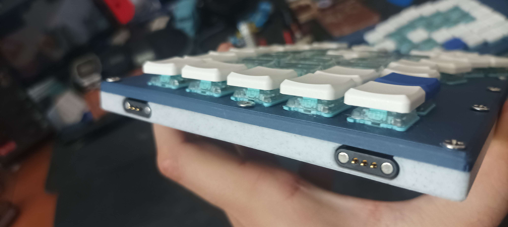
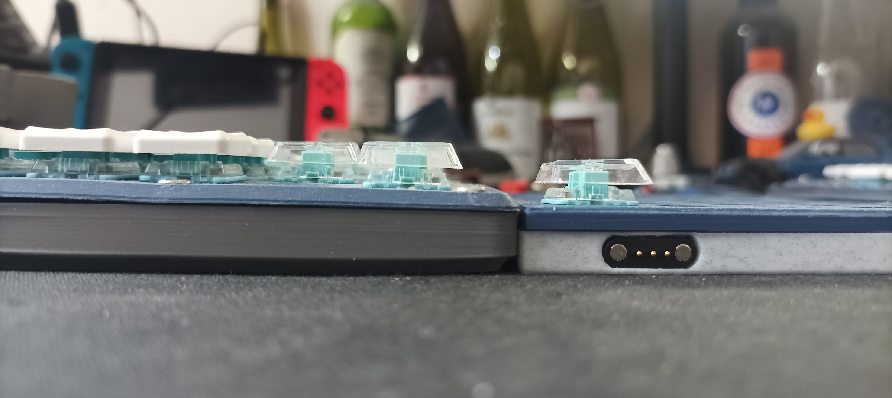
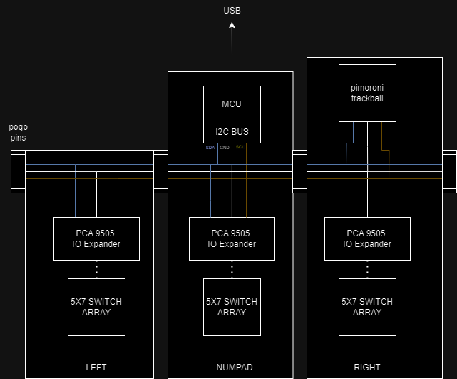

# AV-RK-MK2

The AV-RK MK II is the second iteration of the AVlabs [AV-RK MK I](https://github.com/avmolaei/AV-RK-MK1), the AVlabs "Redox Styled" Mechanical Keyboard.
, that share an I2C bus, which is propagated through magnetic pogo pins (like the Apple MagSafe connector). 

The goal was also to make an even thinner keyboad than the MK I for more comfort: 

(the MK I on the left, and the MK II on the right)
  
The [AV-RK-MK I](https://github.com/avmolaei/AV-RK-MK1) and the [AV-KO1](https://github.com/avmolaei/AV-KO1/) are both handwired keyboards (Expaination in details in the AV-KO1 repo). While handwire is easy to get started on, it has a few problems:

 - The switches are held to the top plate with nothing but friction, and over time (especially if you use "tall" switch+keycap combos, the switch can get loose, or if you knock the board it can get the switch to "pop out":
 - 
 - If you don't plan out your tolerances and screw holes correctly, the top plate will "bow", and make a gap between the plate and body as there is nothing to keep it from bowig
 - Soldering 100 switches and diodes is a good exercise but it is a bit tedious...
 - As most shift registers/IO Expanders are small SMD parts, most "sane" Handwire builds have multiple microcontrôleurs, which is not always ideal. 

The 3 parts connect together with cool magnetic pogo pins. these pogo pins allow a modular layout, i.e if the pogo pins are wired identically and laid out symetrically, you can put the numpad on the left, in the middle, on the right, or even add modules: as long as it communicates with I2C. The architecture of the AV-RK-MK2 is as follows:

 Here the goal was to design and build my "endgame" definition of a keyboard. It had to be "redox styled", it had to have kailh choc robins, and it had to have PCBs!
 
 Indeed, while PCBs do imply a higher cost, they make assembly super simple and allow for more complex layout! The PCA9505 couldn't have been used without the PCBS. As our keyboard has 3 parts, it has 3 PCBs:
 

The PCBs are pretty simple: they are just a bunch of switches connected to the PCA input pins, and the PCA's I2C line being distributed to pins which will be connected to the pogo pins. The middle PCB (numpad) has a small cutout for the XIAO board, and the right PCB has a cutout made to fit a pimoroni trackball, or any other I2C device you would want. 

Available below are:

  

CAD files: Fusion 360 source and STLs for 3D printed parts

FIRMWARE: the arudino code that runs the keyboard

PCB files: gerbers and boms

MODULES: modules, duh.

  

  
`//TODO: shit to fix and/or add
`

PCBs: on all PCBs, the I2C/PWR lines are too close to the edge. On the right PCB, the pins for the pimoroni trackball are reversed, which requires an annoying bodge.

Technically speaking, I2C is not rated for hot swap. In a future iteration, the PCBs **SHOULD** integrate a TCA4307 from TI, a simple I2C buffer to allow for a less buggy kb if the stack is moved from arduino to TinyUSB/from scratch

FIRMWARE: needs to be ported from SAMD21 core to NRF52840. Also, need to fix trackball precision issue. Also, the USB HID lib needs to go from Keyboard.h to TinyUSB.

CAD: maybe enhance aesthetics for the top plate? also need to make some sort of alignement system for the pogo pins, sometimes when docking/undocking modules the pins may short and require a MCU reset

`MODULES:`

**__AV-RK SENSOR MODULE__**: It has a thin OLED display and a square one. It will have an RTC, a humidity/temp sensor and a heartbeat sensor, all that on the I2C BUS. V2 of this module will inclue an independant MCU so the code is not cluttering the main keyboard code. AAAAAAAAA

**__AV-RK MOUSE CHARGER__**: it will have a tiny arduino nano inside, and will recieve commands based on keyboard shortcuts on the I2C bus. The "independant" arduino will trigger LEDs for caps lock/num lock/scroll lock, and will control a tiny servo-actuated arm that shows pogo pins to charge the mouse overnight. The mouse needs to be modified with a USB connector soldered to pogo pins. 

Sensors have been designed, made; all is left is to integrate them in the main code. 

A better, more sensible solution would be to embedd a small low power MCU (e.g: arduino nano) in each module, and make them use a "protocol", where Fn + [NUMPAD NUMBER] sends a set command and the module is programmed to understand the command, instead of integrating everything in the main keyboard code, making a messs. 
2025: i kinda forgot about the modules, after 1 yeaer and half. The only one that sees regular use is the mouse charger.
 

